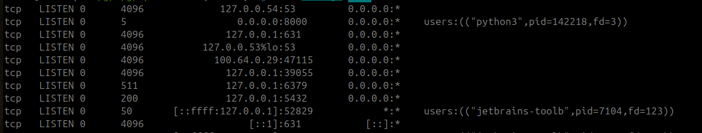

# whoserve
## Download
### linux
```shell
curl -L -o locally https://github.com/Superm4n97/locally/releases/download/v0.1.0/locally-linux-amd64
chmod +x locally
sudo rm -rf /home/$USER/bin/locally
sudo mv ./locally /home/$USER/bin
```
### darwin
```shell
curl -L -o locally https://github.com/Superm4n97/locally/releases/download/v0.1.0/locally-darwin-amd64
chmod +x locally
```
### windows
```shell
curl -L -o locally https://github.com/Superm4n97/locally/releases/download/v0.1.0/locally-windows-amd64
chmod +x locally
```
---
## Commands

```bash
locally list
```
### description

List the currently running servers on your machine.

### output



| Netid | State  | Recv-Q | Send-Q |  Local Address:Port  | Peer Address:Port | Process (PID) |
|-------|--------|--------|--------|----------|-------------------|---------------|
| tcp   | LISTEN | 0      | 5      | 0.0.0.0:8000     | 0.0.0.0:*              | users:(("python3",pid=142218,fd=3))          |

---
```bash
locally expose
```
### description
Exposes the current directory. You can access your computer from any device within your network.
Opening the URL in a browser shows a file browser UI where you can navigate folders, download files,
and upload files into the shared directory (drag & drop or file picker).

### flags
* `port` is an `optional` flag to specify the server port. Default serving port is `8000`.

### output
* A QR code to scan from mobile
* IP address to access from other computer

### upload API
Files can also be uploaded from the command line:

```bash
curl -X POST "http://<ip>:8000/api/upload?dir=/some/subdir" -F "file=@./my-file.txt"
```

* `dir` is the directory (relative to the shared root) to upload into; defaults to the root.
* Multiple `file` fields can be sent in a single request.
* Name collisions are resolved automatically (`file.txt` → `file (1).txt`); existing files are never overwritten.
* Paths are confined to the shared directory — traversal attempts are rejected.

---
```bash
locally proxy
```
### description
Creates a proxy server to which will be expose to your local network and proxy traffics to some other server.

### flags
* `proxy-port` is a `required` port number. It specifies the port number where the proxy server will be run.
* `target-port` is a `required` port number. It specifies the target server port where this proxy server will route the traffic.

### output
* A QR code to scan from mobile
* IP address to access from other computer