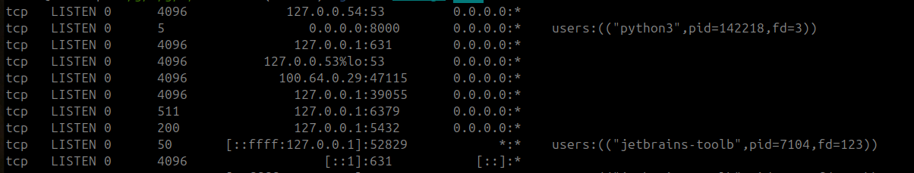

# whoserve
## Download
### Prerequisites
* ubuntu machine

```shell
curl -fsSLO https://github.com/Superm4n97/locally/blob/master/locally
sudo rm -rf /home/$USER/bin/locally
sudo mv ./locally /home/$USER/bin
```
---
## Commands

```bash
locally list
```
### description

List the currently running servers on your machine.

### output



| Netid | State  | Recv-Q | Send-Q |  Local Address:Port  | Peer Address:Port | Process (PID) |
|-------|--------|--------|--------|----------|-------------------|---------------|
| tcp   | LISTEN | 0      | 5      | 0.0.0.0:8000     | 0.0.0.0:*              | users:(("python3",pid=142218,fd=3))          |

---
```bash
locally expose
```
### description
Exposes the current directory. You can access your computer from any device within your network.

### flags
* `port` is an `optional` flag to specify the server port. Default serving port is `8000`.

### output
* A QR code to scan from mobile
* IP address to access from other computer

---
```bash
locally proxy
```
### description
Creates a proxy server to which will be expose to your local network and proxy traffics to some other server.

### flags
* `proxy-port` is a `required` port number. It specifies the port number where the proxy server will be run.
* `target-port` is a `required` port number. It specifies the target server port where this proxy server will route the traffic.

### output
* A QR code to scan from mobile
* IP address to access from other computer